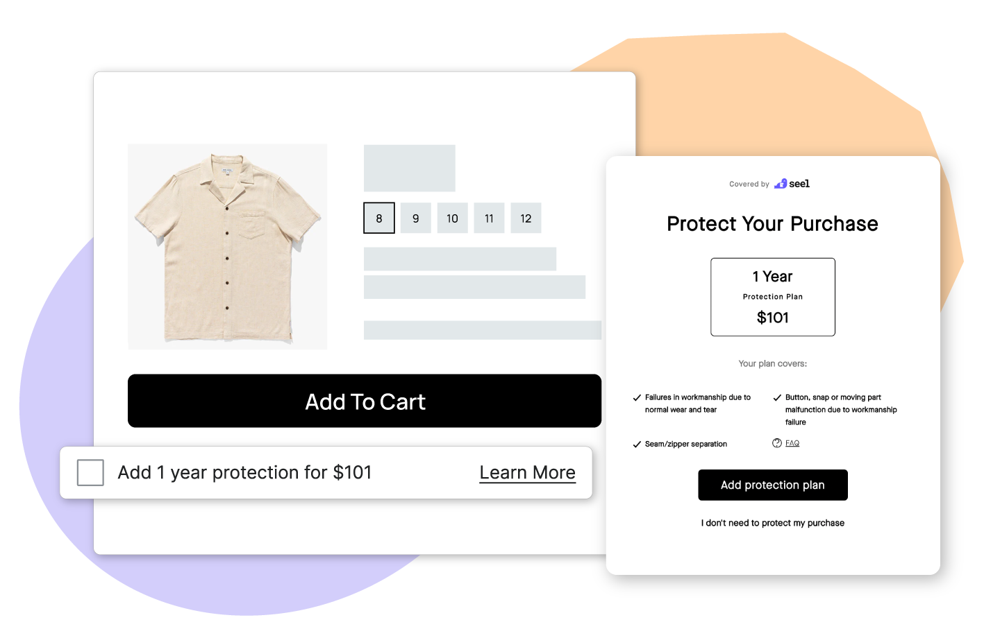

<div align="center">

[](https://seel.com)

# [Seel](https://seel.com)<a id="seel"></a>

Seel API

</div>

## Table of Contents<a id="table-of-contents"></a>

<!-- toc -->

- [Installation](#installation)
- [Getting Started](#getting-started)
- [Reference](#reference)
  * [`seel.claim.getAllClaims`](#seelclaimgetallclaims)
  * [`seel.claim.getById`](#seelclaimgetbyid)
  * [`seel.contract.getById`](#seelcontractgetbyid)
  * [`seel.contract.listContracts`](#seelcontractlistcontracts)
  * [`seel.event.createNewEvent`](#seeleventcreatenewevent)
  * [`seel.fulfillment.cancelFulfillment`](#seelfulfillmentcancelfulfillment)
  * [`seel.fulfillment.createNewFulfillment`](#seelfulfillmentcreatenewfulfillment)
  * [`seel.fulfillment.getDetails`](#seelfulfillmentgetdetails)
  * [`seel.fulfillment.listFulfillments`](#seelfulfillmentlistfulfillments)
  * [`seel.fulfillment.updateFulfillmentDetails`](#seelfulfillmentupdatefulfillmentdetails)
  * [`seel.invoice.getInvoiceById`](#seelinvoicegetinvoicebyid)
  * [`seel.invoice.listInvoices`](#seelinvoicelistinvoices)
  * [`seel.merchant.createNewMerchant`](#seelmerchantcreatenewmerchant)
  * [`seel.merchant.getMerchantDetails`](#seelmerchantgetmerchantdetails)
  * [`seel.merchant.listAllMerchants`](#seelmerchantlistallmerchants)
  * [`seel.merchant.updateMerchantDetails`](#seelmerchantupdatemerchantdetails)
  * [`seel.order.batchCreateOrders`](#seelorderbatchcreateorders)
  * [`seel.order.cancelOrderById`](#seelordercancelorderbyid)
  * [`seel.order.createNewOrder`](#seelordercreateneworder)
  * [`seel.order.getById`](#seelordergetbyid)
  * [`seel.order.updateOrderDetails`](#seelorderupdateorderdetails)
  * [`seel.product.addNewProduct`](#seelproductaddnewproduct)
  * [`seel.product.batchCreateProducts`](#seelproductbatchcreateproducts)
  * [`seel.product.getProductById`](#seelproductgetproductbyid)
  * [`seel.product.listPlans`](#seelproductlistplans)
  * [`seel.product.removeProductById`](#seelproductremoveproductbyid)
  * [`seel.product.updateProductDetails`](#seelproductupdateproductdetails)
  * [`seel.quote.generateQuote`](#seelquotegeneratequote)
  * [`seel.quote.getById`](#seelquotegetbyid)

<!-- tocstop -->

## Installation<a id="installation"></a>
<div align="center">
  <a href="https://konfigthis.com/sdk-sign-up?company=Seel&language=TypeScript">
    
  </a>
</div>

## Getting Started<a id="getting-started"></a>

```typescript
import { Seel } from "seel-typescript-sdk";

const seel = new Seel({
  // Defining the base path is optional and defaults to https://api-test.seel.com/v1
  // basePath: "https://api-test.seel.com/v1",
});

const getAllClaimsResponse = await seel.claim.getAllClaims({
  xSeelApiKey: "e2b4f9c8d3a7e6d2f5b0c4a1d8e9b6",
  xSeelApiVersion: "1.3.0",
  page: 0,
  pageSize: 100,
  partner: "seel",
});

console.log(getAllClaimsResponse);
```

## Reference<a id="reference"></a>


### `seel.claim.getAllClaims`<a id="seelclaimgetallclaims"></a>

List claims

#### 🛠️ Usage<a id="🛠️-usage"></a>

```typescript
const getAllClaimsResponse = await seel.claim.getAllClaims({
  xSeelApiKey: "e2b4f9c8d3a7e6d2f5b0c4a1d8e9b6",
  xSeelApiVersion: "1.3.0",
  page: 0,
  pageSize: 100,
  partner: "seel",
});
```

#### ⚙️ Parameters<a id="⚙️-parameters"></a>

##### xSeelApiKey: `string`<a id="xseelapikey-string"></a>

Your Seel API key

##### xSeelApiVersion: `string`<a id="xseelapiversion-string"></a>

Version of the Seel API to use

##### partner: `string`<a id="partner-string"></a>

partner name

##### orderId: `string`<a id="orderid-string"></a>

Query by order ID

##### page: `number`<a id="page-number"></a>

Query by page, default 0

##### pageSize: `number`<a id="pagesize-number"></a>

Query by page_size, default 100

#### 🔄 Return<a id="🔄-return"></a>

[ClaimGetAllClaimsResponse](./models/claim-get-all-claims-response.ts)

#### 🌐 Endpoint<a id="🌐-endpoint"></a>

`/{partner}/claims` `GET`

[🔙 **Back to Table of Contents**](#table-of-contents)

---


### `seel.claim.getById`<a id="seelclaimgetbyid"></a>

Get a claim

#### 🛠️ Usage<a id="🛠️-usage"></a>

```typescript
const getByIdResponse = await seel.claim.getById({
  claimId: "claimId_example",
  xSeelApiKey: "e2b4f9c8d3a7e6d2f5b0c4a1d8e9b6",
  xSeelApiVersion: "1.3.0",
  partner: "seel",
});
```

#### ⚙️ Parameters<a id="⚙️-parameters"></a>

##### claimId: `string`<a id="claimid-string"></a>

ID of the claim

##### xSeelApiKey: `string`<a id="xseelapikey-string"></a>

Your Seel API key

##### xSeelApiVersion: `string`<a id="xseelapiversion-string"></a>

Version of the Seel API to use

##### partner: `string`<a id="partner-string"></a>

partner name

#### 🔄 Return<a id="🔄-return"></a>

[Claim](./models/claim.ts)

#### 🌐 Endpoint<a id="🌐-endpoint"></a>

`/{partner}/claims/{claim_id}` `GET`

[🔙 **Back to Table of Contents**](#table-of-contents)

---


### `seel.contract.getById`<a id="seelcontractgetbyid"></a>

Get a contract

#### 🛠️ Usage<a id="🛠️-usage"></a>

```typescript
const getByIdResponse = await seel.contract.getById({
  contractId: "contractId_example",
  xSeelApiKey: "e2b4f9c8d3a7e6d2f5b0c4a1d8e9b6",
  xSeelApiVersion: "1.3.0",
  partner: "seel",
});
```

#### ⚙️ Parameters<a id="⚙️-parameters"></a>

##### contractId: `string`<a id="contractid-string"></a>

ID of the contract

##### xSeelApiKey: `string`<a id="xseelapikey-string"></a>

Your Seel API key

##### xSeelApiVersion: `string`<a id="xseelapiversion-string"></a>

Version of the Seel API to use

##### partner: `string`<a id="partner-string"></a>

partner name

#### 🔄 Return<a id="🔄-return"></a>

[Contract](./models/contract.ts)

#### 🌐 Endpoint<a id="🌐-endpoint"></a>

`/{partner}/contracts/{contract_id}` `GET`

[🔙 **Back to Table of Contents**](#table-of-contents)

---


### `seel.contract.listContracts`<a id="seelcontractlistcontracts"></a>

List contracts

#### 🛠️ Usage<a id="🛠️-usage"></a>

```typescript
const listContractsResponse = await seel.contract.listContracts({
  xSeelApiKey: "e2b4f9c8d3a7e6d2f5b0c4a1d8e9b6",
  xSeelApiVersion: "1.3.0",
  page: 0,
  pageSize: 100,
  partner: "seel",
});
```

#### ⚙️ Parameters<a id="⚙️-parameters"></a>

##### xSeelApiKey: `string`<a id="xseelapikey-string"></a>

Your Seel API key

##### xSeelApiVersion: `string`<a id="xseelapiversion-string"></a>

Version of the Seel API to use

##### partner: `string`<a id="partner-string"></a>

partner name

##### orderId: `string`<a id="orderid-string"></a>

Query by order ID

##### page: `number`<a id="page-number"></a>

Query by page, default 0

##### pageSize: `number`<a id="pagesize-number"></a>

Query by page_size, default 100

#### 🔄 Return<a id="🔄-return"></a>

[ContractListContractsResponse](./models/contract-list-contracts-response.ts)

#### 🌐 Endpoint<a id="🌐-endpoint"></a>

`/{partner}/contracts` `GET`

[🔙 **Back to Table of Contents**](#table-of-contents)

---


### `seel.event.createNewEvent`<a id="seeleventcreatenewevent"></a>

Create events

#### 🛠️ Usage<a id="🛠️-usage"></a>

```typescript
const createNewEventResponse = await seel.event.createNewEvent({
  xSeelApiKey: "e2b4f9c8d3a7e6d2f5b0c4a1d8e9b6",
  xSeelApiVersion: "1.3.0",
  partner: "seel",
  session_id: "1680749645592",
  event_ts: "1680749645592",
  customer_id: "229413056",
  device_id: "3kGv6F1i8L",
  client_ip: "64.64.230.190",
  event_source: "web",
  event_type: "cart_add",
  event_info: {},
});
```

#### ⚙️ Parameters<a id="⚙️-parameters"></a>

##### session_id: `string`<a id="session_id-string"></a>

Session ID

##### customer_id: `string`<a id="customer_id-string"></a>

Customer ID

##### event_source: `string`<a id="event_source-string"></a>

Event source

##### event_type: `string`<a id="event_type-string"></a>

Event type

##### event_info: `object`<a id="event_info-object"></a>

Each event_type has its own unique schema. For specific details, please refer to the custom pixel guide.

##### xSeelApiKey: `string`<a id="xseelapikey-string"></a>

Your Seel API key

##### xSeelApiVersion: `string`<a id="xseelapiversion-string"></a>

Version of the Seel API to use

##### partner: `string`<a id="partner-string"></a>

partner name

##### event_ts: `string`<a id="event_ts-string"></a>

Event created timestamp in milliseconds

##### device_id: `string`<a id="device_id-string"></a>

Device ID

##### client_ip: `string`<a id="client_ip-string"></a>

Browser IP address

#### 🔄 Return<a id="🔄-return"></a>

[Event](./models/event.ts)

#### 🌐 Endpoint<a id="🌐-endpoint"></a>

`/{partner}/events` `POST`

[🔙 **Back to Table of Contents**](#table-of-contents)

---


### `seel.fulfillment.cancelFulfillment`<a id="seelfulfillmentcancelfulfillment"></a>

Cancel a fulfillment

#### 🛠️ Usage<a id="🛠️-usage"></a>

```typescript
const cancelFulfillmentResponse = await seel.fulfillment.cancelFulfillment({
  orderId: "orderId_example",
  fulfillmentId: "fulfillmentId_example",
  xSeelApiKey: "e2b4f9c8d3a7e6d2f5b0c4a1d8e9b6",
  xSeelApiVersion: "1.3.0",
  partner: "seel",
});
```

#### ⚙️ Parameters<a id="⚙️-parameters"></a>

##### orderId: `string`<a id="orderid-string"></a>

ID of the order

##### fulfillmentId: `string`<a id="fulfillmentid-string"></a>

ID of the fulfillment

##### xSeelApiKey: `string`<a id="xseelapikey-string"></a>

Your Seel API key

##### xSeelApiVersion: `string`<a id="xseelapiversion-string"></a>

Version of the Seel API to use

##### partner: `string`<a id="partner-string"></a>

partner name

#### 🔄 Return<a id="🔄-return"></a>

[Fulfillment](./models/fulfillment.ts)

#### 🌐 Endpoint<a id="🌐-endpoint"></a>

`/{partner}/orders/{order_id}/fulfillments/{fulfillment_id}/cancel` `POST`

[🔙 **Back to Table of Contents**](#table-of-contents)

---


### `seel.fulfillment.createNewFulfillment`<a id="seelfulfillmentcreatenewfulfillment"></a>

Create a fulfillment

#### 🛠️ Usage<a id="🛠️-usage"></a>

```typescript
const createNewFulfillmentResponse =
  await seel.fulfillment.createNewFulfillment({
    orderId: "orderId_example",
    xSeelApiKey: "e2b4f9c8d3a7e6d2f5b0c4a1d8e9b6",
    xSeelApiVersion: "1.3.0",
    partner: "seel",
    fulfillment_id: "fulfillment_id",
    created_ts: "1686049398000",
    updated_ts: "1686049398000",
    tracking_number: "YT1231232113",
    carrier: "USPS",
    tracking_url: "https://tools.usps.com/go/TrackConfirmAction_input",
    shipment_status: "delivered",
    line_items: [
      {
        line_item_id: "12345678",
        quantity: 1,
      },
    ],
  });
```

#### ⚙️ Parameters<a id="⚙️-parameters"></a>

##### fulfillment_id: `string`<a id="fulfillment_id-string"></a>

Fulfillment ID

##### created_ts: `string`<a id="created_ts-string"></a>

Fulfillment created timestamp in milliseconds

##### updated_ts: `string`<a id="updated_ts-string"></a>

Fulfillment updated timestamp in milliseconds

##### tracking_number: `string`<a id="tracking_number-string"></a>

The tracking number of the fulfillment

##### carrier: `string`<a id="carrier-string"></a>

The shipping carrier of the fulfillment

##### shipment_status: `string`<a id="shipment_status-string"></a>

The shipping status of the fulfillment

##### line_items: [`FulfillmentLineItemsInner`](./models/fulfillment-line-items-inner.ts)[]<a id="line_items-fulfillmentlineitemsinnermodelsfulfillment-line-items-innerts"></a>

The list of items included in the fulfillment.

##### orderId: `string`<a id="orderid-string"></a>

ID of the order

##### xSeelApiKey: `string`<a id="xseelapikey-string"></a>

Your Seel API key

##### xSeelApiVersion: `string`<a id="xseelapiversion-string"></a>

Version of the Seel API to use

##### partner: `string`<a id="partner-string"></a>

partner name

##### tracking_url: `string`<a id="tracking_url-string"></a>

The tracking url of the fulfillment

#### 🔄 Return<a id="🔄-return"></a>

[Fulfillment](./models/fulfillment.ts)

#### 🌐 Endpoint<a id="🌐-endpoint"></a>

`/{partner}/orders/{order_id}/fulfillments` `POST`

[🔙 **Back to Table of Contents**](#table-of-contents)

---


### `seel.fulfillment.getDetails`<a id="seelfulfillmentgetdetails"></a>

Get a fulfillment

#### 🛠️ Usage<a id="🛠️-usage"></a>

```typescript
const getDetailsResponse = await seel.fulfillment.getDetails({
  orderId: "orderId_example",
  fulfillmentId: "fulfillmentId_example",
  xSeelApiKey: "e2b4f9c8d3a7e6d2f5b0c4a1d8e9b6",
  xSeelApiVersion: "1.3.0",
  partner: "seel",
});
```

#### ⚙️ Parameters<a id="⚙️-parameters"></a>

##### orderId: `string`<a id="orderid-string"></a>

ID of the order

##### fulfillmentId: `string`<a id="fulfillmentid-string"></a>

ID of the fulfillment

##### xSeelApiKey: `string`<a id="xseelapikey-string"></a>

Your Seel API key

##### xSeelApiVersion: `string`<a id="xseelapiversion-string"></a>

Version of the Seel API to use

##### partner: `string`<a id="partner-string"></a>

partner name

#### 🔄 Return<a id="🔄-return"></a>

[Fulfillment](./models/fulfillment.ts)

#### 🌐 Endpoint<a id="🌐-endpoint"></a>

`/{partner}/orders/{order_id}/fulfillments/{fulfillment_id}` `GET`

[🔙 **Back to Table of Contents**](#table-of-contents)

---


### `seel.fulfillment.listFulfillments`<a id="seelfulfillmentlistfulfillments"></a>

List fulfillments

#### 🛠️ Usage<a id="🛠️-usage"></a>

```typescript
const listFulfillmentsResponse = await seel.fulfillment.listFulfillments({
  orderId: "orderId_example",
  xSeelApiKey: "e2b4f9c8d3a7e6d2f5b0c4a1d8e9b6",
  xSeelApiVersion: "1.3.0",
  page: 0,
  pageSize: 100,
  partner: "seel",
});
```

#### ⚙️ Parameters<a id="⚙️-parameters"></a>

##### orderId: `string`<a id="orderid-string"></a>

ID of the order

##### xSeelApiKey: `string`<a id="xseelapikey-string"></a>

Your Seel API key

##### xSeelApiVersion: `string`<a id="xseelapiversion-string"></a>

Version of the Seel API to use

##### partner: `string`<a id="partner-string"></a>

partner name

##### page: `number`<a id="page-number"></a>

Query by page, default 0

##### pageSize: `number`<a id="pagesize-number"></a>

Query by page_size, default 100

#### 🔄 Return<a id="🔄-return"></a>

[FulfillmentListFulfillmentsResponse](./models/fulfillment-list-fulfillments-response.ts)

#### 🌐 Endpoint<a id="🌐-endpoint"></a>

`/{partner}/orders/{order_id}/fulfillments` `GET`

[🔙 **Back to Table of Contents**](#table-of-contents)

---


### `seel.fulfillment.updateFulfillmentDetails`<a id="seelfulfillmentupdatefulfillmentdetails"></a>

Update a fulfillment

#### 🛠️ Usage<a id="🛠️-usage"></a>

```typescript
const updateFulfillmentDetailsResponse =
  await seel.fulfillment.updateFulfillmentDetails({
    orderId: "orderId_example",
    fulfillmentId: "fulfillmentId_example",
    xSeelApiKey: "e2b4f9c8d3a7e6d2f5b0c4a1d8e9b6",
    xSeelApiVersion: "1.3.0",
    partner: "seel",
    updated_ts: "1686049398000",
    tracking_number: "YT1231232113",
    carrier: "USPS",
    tracking_url: "https://tools.usps.com/go/TrackConfirmAction_input",
    shipment_status: "delivered",
    line_items: [
      {
        line_item_id: "12345678",
        quantity: 1,
      },
    ],
  });
```

#### ⚙️ Parameters<a id="⚙️-parameters"></a>

##### updated_ts: `string`<a id="updated_ts-string"></a>

Fulfillment updated timestamp in milliseconds

##### tracking_number: `string`<a id="tracking_number-string"></a>

The tracking number of the fulfillment

##### carrier: `string`<a id="carrier-string"></a>

The shipping carrier of the fulfillment

##### shipment_status: `string`<a id="shipment_status-string"></a>

The shipping status of the fulfillment

##### line_items: [`FulfillmentUpdateFulfillmentDetailsRequestLineItemsInner`](./models/fulfillment-update-fulfillment-details-request-line-items-inner.ts)[]<a id="line_items-fulfillmentupdatefulfillmentdetailsrequestlineitemsinnermodelsfulfillment-update-fulfillment-details-request-line-items-innerts"></a>

The list of items included in the fulfillment.

##### orderId: `string`<a id="orderid-string"></a>

ID of the order

##### fulfillmentId: `string`<a id="fulfillmentid-string"></a>

ID of the fulfillment

##### xSeelApiKey: `string`<a id="xseelapikey-string"></a>

Your Seel API key

##### xSeelApiVersion: `string`<a id="xseelapiversion-string"></a>

Version of the Seel API to use

##### partner: `string`<a id="partner-string"></a>

partner name

##### tracking_url: `string`<a id="tracking_url-string"></a>

The tracking url of the fulfillment

#### 🔄 Return<a id="🔄-return"></a>

[Fulfillment](./models/fulfillment.ts)

#### 🌐 Endpoint<a id="🌐-endpoint"></a>

`/{partner}/orders/{order_id}/fulfillments/{fulfillment_id}` `POST`

[🔙 **Back to Table of Contents**](#table-of-contents)

---


### `seel.invoice.getInvoiceById`<a id="seelinvoicegetinvoicebyid"></a>

Get an invoice

#### 🛠️ Usage<a id="🛠️-usage"></a>

```typescript
const getInvoiceByIdResponse = await seel.invoice.getInvoiceById({
  invoiceId: "12345",
  xSeelApiKey: "e2b4f9c8d3a7e6d2f5b0c4a1d8e9b6",
  xSeelApiVersion: "1.3.0",
  partner: "seel",
});
```

#### ⚙️ Parameters<a id="⚙️-parameters"></a>

##### invoiceId: `string`<a id="invoiceid-string"></a>

ID of the invoice

##### xSeelApiKey: `string`<a id="xseelapikey-string"></a>

Your Seel API key

##### xSeelApiVersion: `string`<a id="xseelapiversion-string"></a>

Version of the Seel API to use

##### partner: `string`<a id="partner-string"></a>

partner name

#### 🔄 Return<a id="🔄-return"></a>

[Invoice](./models/invoice.ts)

#### 🌐 Endpoint<a id="🌐-endpoint"></a>

`/{partner}/invoices/{invoice_id}` `GET`

[🔙 **Back to Table of Contents**](#table-of-contents)

---


### `seel.invoice.listInvoices`<a id="seelinvoicelistinvoices"></a>

List invoices

#### 🛠️ Usage<a id="🛠️-usage"></a>

```typescript
const listInvoicesResponse = await seel.invoice.listInvoices({
  xSeelApiKey: "e2b4f9c8d3a7e6d2f5b0c4a1d8e9b6",
  xSeelApiVersion: "1.3.0",
  page: 0,
  pageSize: 100,
  partner: "seel",
});
```

#### ⚙️ Parameters<a id="⚙️-parameters"></a>

##### xSeelApiKey: `string`<a id="xseelapikey-string"></a>

Your Seel API key

##### xSeelApiVersion: `string`<a id="xseelapiversion-string"></a>

Version of the Seel API to use

##### partner: `string`<a id="partner-string"></a>

partner name

##### page: `number`<a id="page-number"></a>

Query by page, default 0

##### pageSize: `number`<a id="pagesize-number"></a>

Query by page_size, default 100

#### 🔄 Return<a id="🔄-return"></a>

[InvoiceListInvoicesResponse](./models/invoice-list-invoices-response.ts)

#### 🌐 Endpoint<a id="🌐-endpoint"></a>

`/{partner}/invoices` `GET`

[🔙 **Back to Table of Contents**](#table-of-contents)

---


### `seel.merchant.createNewMerchant`<a id="seelmerchantcreatenewmerchant"></a>

Create a merchant

#### 🛠️ Usage<a id="🛠️-usage"></a>

```typescript
const createNewMerchantResponse = await seel.merchant.createNewMerchant({
  xSeelApiKey: "e2b4f9c8d3a7e6d2f5b0c4a1d8e9b6",
  xSeelApiVersion: "1.3.0",
  partner: "seel",
  shop_id: "shop123",
  admin_domain: "shop.myshopify.com",
  shop_domain: "www.myshop.com",
  shop_platform: "Shopify",
  shop_currency: "USD",
  shop_name: "My Shop",
  contact_name: "My Shop",
  contact_email: "contact@myshop.com",
  contact_phone_number: "555-1234",
  seel_services: [
    {
      type: "seel-ra",
      is_enabled: true,
      is_default_on: true,
    },
  ],
});
```

#### ⚙️ Parameters<a id="⚙️-parameters"></a>

##### shop_id: `string`<a id="shop_id-string"></a>

The identifier for the shop or store within the partner\\\'s platform.

##### admin_domain: `string`<a id="admin_domain-string"></a>

The original subdomain domain for the shop provided by the ecommerce platform, e.g. subdomain.myshopify.com

##### shop_domain: `string`<a id="shop_domain-string"></a>

The custom domain name assigned to the shop, e.g. www.myshop.com.

##### shop_platform: `string`<a id="shop_platform-string"></a>

The source ecommerce platform for the shop, e.g. Shopify, BigCommerce.

##### shop_currency: `string`<a id="shop_currency-string"></a>

3-letter ISO 4217 currency code for the primary currency used in the shop, e.g. USD, EUR.

##### shop_name: `string`<a id="shop_name-string"></a>

The registered business name for the shop.

##### contact_name: `string`<a id="contact_name-string"></a>

The registered business name for the merchant.

##### contact_email: `string`<a id="contact_email-string"></a>

The contact email address on file for the merchant.

##### seel_services: [`MerchantCreateNewMerchantRequestSeelServicesInner`](./models/merchant-create-new-merchant-request-seel-services-inner.ts)[]<a id="seel_services-merchantcreatenewmerchantrequestseelservicesinnermodelsmerchant-create-new-merchant-request-seel-services-innerts"></a>

##### xSeelApiKey: `string`<a id="xseelapikey-string"></a>

Your Seel API key

##### xSeelApiVersion: `string`<a id="xseelapiversion-string"></a>

Version of the Seel API to use

##### partner: `string`<a id="partner-string"></a>

partner name

##### contact_phone_number: `string`<a id="contact_phone_number-string"></a>

The phone number on file for the merchant.

#### 🔄 Return<a id="🔄-return"></a>

[Merchant](./models/merchant.ts)

#### 🌐 Endpoint<a id="🌐-endpoint"></a>

`/{partner}/merchants` `POST`

[🔙 **Back to Table of Contents**](#table-of-contents)

---


### `seel.merchant.getMerchantDetails`<a id="seelmerchantgetmerchantdetails"></a>

Get a merchant

#### 🛠️ Usage<a id="🛠️-usage"></a>

```typescript
const getMerchantDetailsResponse = await seel.merchant.getMerchantDetails({
  merchantId: "merchantId_example",
  xSeelApiKey: "e2b4f9c8d3a7e6d2f5b0c4a1d8e9b6",
  xSeelApiVersion: "1.3.0",
  partner: "seel",
});
```

#### ⚙️ Parameters<a id="⚙️-parameters"></a>

##### merchantId: `string`<a id="merchantid-string"></a>

ID of the merchant

##### xSeelApiKey: `string`<a id="xseelapikey-string"></a>

Your Seel API key

##### xSeelApiVersion: `string`<a id="xseelapiversion-string"></a>

Version of the Seel API to use

##### partner: `string`<a id="partner-string"></a>

partner name

#### 🔄 Return<a id="🔄-return"></a>

[Merchant](./models/merchant.ts)

#### 🌐 Endpoint<a id="🌐-endpoint"></a>

`/{partner}/merchants/{merchant_id}` `GET`

[🔙 **Back to Table of Contents**](#table-of-contents)

---


### `seel.merchant.listAllMerchants`<a id="seelmerchantlistallmerchants"></a>

List merchants

#### 🛠️ Usage<a id="🛠️-usage"></a>

```typescript
const listAllMerchantsResponse = await seel.merchant.listAllMerchants({
  xSeelApiKey: "e2b4f9c8d3a7e6d2f5b0c4a1d8e9b6",
  xSeelApiVersion: "1.3.0",
  page: 0,
  pageSize: 100,
  partner: "seel",
});
```

#### ⚙️ Parameters<a id="⚙️-parameters"></a>

##### xSeelApiKey: `string`<a id="xseelapikey-string"></a>

Your Seel API key

##### xSeelApiVersion: `string`<a id="xseelapiversion-string"></a>

Version of the Seel API to use

##### partner: `string`<a id="partner-string"></a>

partner name

##### page: `number`<a id="page-number"></a>

Query by page, default 0

##### pageSize: `number`<a id="pagesize-number"></a>

Query by page_size, default 100

#### 🔄 Return<a id="🔄-return"></a>

[MerchantListAllMerchantsResponse](./models/merchant-list-all-merchants-response.ts)

#### 🌐 Endpoint<a id="🌐-endpoint"></a>

`/{partner}/merchants` `GET`

[🔙 **Back to Table of Contents**](#table-of-contents)

---


### `seel.merchant.updateMerchantDetails`<a id="seelmerchantupdatemerchantdetails"></a>

Update a merchant

#### 🛠️ Usage<a id="🛠️-usage"></a>

```typescript
const updateMerchantDetailsResponse = await seel.merchant.updateMerchantDetails(
  {
    merchantId: "merchantId_example",
    xSeelApiKey: "e2b4f9c8d3a7e6d2f5b0c4a1d8e9b6",
    xSeelApiVersion: "1.3.0",
    partner: "seel",
    shop_id: "shop123",
    admin_domain: "shop.myshopify.com",
    shop_domain: "www.myshop.com",
    shop_platform: "Shopify",
    shop_currency: "USD",
    shop_name: "My Shop",
    contact_name: "My Shop",
    contact_email: "contact@myshop.com",
    contact_phone_number: "555-1234",
  }
);
```

#### ⚙️ Parameters<a id="⚙️-parameters"></a>

##### merchantId: `string`<a id="merchantid-string"></a>

ID of the merchant

##### xSeelApiKey: `string`<a id="xseelapikey-string"></a>

Your Seel API key

##### xSeelApiVersion: `string`<a id="xseelapiversion-string"></a>

Version of the Seel API to use

##### partner: `string`<a id="partner-string"></a>

partner name

##### shop_id: `string`<a id="shop_id-string"></a>

The identifier for the shop or store within the partner\\\'s platform.

##### admin_domain: `string`<a id="admin_domain-string"></a>

The original subdomain domain for the shop provided by the ecommerce platform, e.g. subdomain.myshopify.com

##### shop_domain: `string`<a id="shop_domain-string"></a>

The custom domain name assigned to the shop, e.g. www.myshop.com.

##### shop_platform: `string`<a id="shop_platform-string"></a>

The source ecommerce platform for the shop, e.g. Shopify, BigCommerce.

##### shop_currency: `string`<a id="shop_currency-string"></a>

3-letter ISO 4217 currency code for the primary currency used in the shop, e.g. USD, EUR.

##### shop_name: `string`<a id="shop_name-string"></a>

The registered business name for the shop.

##### contact_name: `string`<a id="contact_name-string"></a>

The registered business name for the merchant.

##### contact_email: `string`<a id="contact_email-string"></a>

The contact email address on file for the merchant.

##### contact_phone_number: `string`<a id="contact_phone_number-string"></a>

The phone number on file for the merchant.

##### seel_services: [`MerchantUpdateMerchantDetailsRequestSeelServicesInner`](./models/merchant-update-merchant-details-request-seel-services-inner.ts)[]<a id="seel_services-merchantupdatemerchantdetailsrequestseelservicesinnermodelsmerchant-update-merchant-details-request-seel-services-innerts"></a>

#### 🔄 Return<a id="🔄-return"></a>

[Merchant](./models/merchant.ts)

#### 🌐 Endpoint<a id="🌐-endpoint"></a>

`/{partner}/merchants/{merchant_id}` `POST`

[🔙 **Back to Table of Contents**](#table-of-contents)

---


### `seel.order.batchCreateOrders`<a id="seelorderbatchcreateorders"></a>

Batch create orders

#### 🛠️ Usage<a id="🛠️-usage"></a>

```typescript
const batchCreateOrdersResponse = await seel.order.batchCreateOrders({
  xSeelApiKey: "e2b4f9c8d3a7e6d2f5b0c4a1d8e9b6",
  xSeelApiVersion: "1.3.0",
  partner: "seel",
});
```

#### ⚙️ Parameters<a id="⚙️-parameters"></a>

##### xSeelApiKey: `string`<a id="xseelapikey-string"></a>

Your Seel API key

##### xSeelApiVersion: `string`<a id="xseelapiversion-string"></a>

Version of the Seel API to use

##### partner: `string`<a id="partner-string"></a>

partner name

##### orders: [`Order`](./models/order.ts)[]<a id="orders-ordermodelsorderts"></a>

The list of orders.

#### 🔄 Return<a id="🔄-return"></a>

[OrderBatchCreateOrdersResponse](./models/order-batch-create-orders-response.ts)

#### 🌐 Endpoint<a id="🌐-endpoint"></a>

`/{partner}/orders/batch` `POST`

[🔙 **Back to Table of Contents**](#table-of-contents)

---


### `seel.order.cancelOrderById`<a id="seelordercancelorderbyid"></a>

Cancel an order

#### 🛠️ Usage<a id="🛠️-usage"></a>

```typescript
const cancelOrderByIdResponse = await seel.order.cancelOrderById({
  orderId: "orderId_example",
  xSeelApiKey: "e2b4f9c8d3a7e6d2f5b0c4a1d8e9b6",
  xSeelApiVersion: "1.3.0",
  partner: "seel",
});
```

#### ⚙️ Parameters<a id="⚙️-parameters"></a>

##### orderId: `string`<a id="orderid-string"></a>

ID of the order

##### xSeelApiKey: `string`<a id="xseelapikey-string"></a>

Your Seel API key

##### xSeelApiVersion: `string`<a id="xseelapiversion-string"></a>

Version of the Seel API to use

##### partner: `string`<a id="partner-string"></a>

partner name

#### 🔄 Return<a id="🔄-return"></a>

[Order](./models/order.ts)

#### 🌐 Endpoint<a id="🌐-endpoint"></a>

`/{partner}/orders/{order_id}/cancel` `POST`

[🔙 **Back to Table of Contents**](#table-of-contents)

---


### `seel.order.createNewOrder`<a id="seelordercreateneworder"></a>

Create an order

#### 🛠️ Usage<a id="🛠️-usage"></a>

```typescript
const createNewOrderResponse = await seel.order.createNewOrder({
  xSeelApiKey: "e2b4f9c8d3a7e6d2f5b0c4a1d8e9b6",
  xSeelApiVersion: "1.3.0",
  partner: "seel",
  order_id: "order12345",
  order_number: "#12345",
  session_id: "12345678",
  cart_id: "cart_000001",
  merchant_id: "merchant_000001",
  device_id: "device123",
  client_ip: "127.0.0.1",
  created_ts: "1686049398000",
  line_items: [
    {
      line_item_id: "43f6d61d-9f19-45aa-a941-a43dfe8d0045",
      product_id: "43f6d61d-9f19-45aa-a941-a43dfe8d0045",
      product_title: "title_1",
      product_description: "description_1",
      variant_id: "91232f4c-0acd-4229-a418-bc03c5777359",
      variant_title: "variant_title",
      sku: "sku",
      seller_id: "91232f4c-0acd-4229-a418-bc03c5777359",
      seller_name: "seller name",
      brand_name: "brand",
      quantity: 1,
      price: 34.33,
      allocated_discounts: 10,
      sales_tax: 4.33,
      retail_price: 34.33,
      final_price: 28.66,
      currency: "USD",
      requires_shipping: true,
      product_url: "image_url",
      image_url: "image_url",
      category_1: "main category",
      category_2: "sub category 2",
      category_3: "sub category 3",
      category_4: "sub category 4",
      is_final_sale: true,
      condition: "new",
    },
  ],
  shipping_address: {
    address_1: "123 Main St",
    address_2: "Apt 1001",
    city: "San Francisco",
    state: "CA",
    zipcode: "94105",
    country: "US",
  },
  customer: {
    customer_id: "cus_123",
    first_name: "John",
    last_name: "Doe",
    email: "johndoe@test.com",
    phone: "615246789",
  },
});
```

#### ⚙️ Parameters<a id="⚙️-parameters"></a>

##### order_id: `string`<a id="order_id-string"></a>

The unique identifier for the order in the system.

##### order_number: `string`<a id="order_number-string"></a>

The reference number that is visible to the merchant and shopper. Use the order ID value if there is no separate order number.

##### session_id: `string`<a id="session_id-string"></a>

Shopping session ID of the order

##### created_ts: `string`<a id="created_ts-string"></a>

Order created timestamp in milliseconds

##### line_items: [`Item`](./models/item.ts)[]<a id="line_items-itemmodelsitemts"></a>

The list of items included in the order.

##### shipping_address: [`Address`](./models/address.ts)<a id="shipping_address-addressmodelsaddressts"></a>

##### customer: [`Customer`](./models/customer.ts)<a id="customer-customermodelscustomerts"></a>

##### xSeelApiKey: `string`<a id="xseelapikey-string"></a>

Your Seel API key

##### xSeelApiVersion: `string`<a id="xseelapiversion-string"></a>

Version of the Seel API to use

##### partner: `string`<a id="partner-string"></a>

partner name

##### cart_id: `string`<a id="cart_id-string"></a>

Cart ID of the order

##### merchant_id: `string`<a id="merchant_id-string"></a>

Merchant ID of the order

##### device_id: `string`<a id="device_id-string"></a>

The ID of the client device.

##### client_ip: `string`<a id="client_ip-string"></a>

The IP address of the client.

##### seel_services: [`OrderCreateNewOrderRequestSeelServicesInner`](./models/order-create-new-order-request-seel-services-inner.ts)[]<a id="seel_services-ordercreateneworderrequestseelservicesinnermodelsorder-create-new-order-request-seel-services-innerts"></a>

The list of Seel services of the order.

##### extra_info: `object`<a id="extra_info-object"></a>

Additional information for the order

#### 🔄 Return<a id="🔄-return"></a>

[Order](./models/order.ts)

#### 🌐 Endpoint<a id="🌐-endpoint"></a>

`/{partner}/orders` `POST`

[🔙 **Back to Table of Contents**](#table-of-contents)

---


### `seel.order.getById`<a id="seelordergetbyid"></a>

Get an order

#### 🛠️ Usage<a id="🛠️-usage"></a>

```typescript
const getByIdResponse = await seel.order.getById({
  orderId: "orderId_example",
  xSeelApiKey: "e2b4f9c8d3a7e6d2f5b0c4a1d8e9b6",
  xSeelApiVersion: "1.3.0",
  partner: "seel",
});
```

#### ⚙️ Parameters<a id="⚙️-parameters"></a>

##### orderId: `string`<a id="orderid-string"></a>

ID of the order

##### xSeelApiKey: `string`<a id="xseelapikey-string"></a>

Your Seel API key

##### xSeelApiVersion: `string`<a id="xseelapiversion-string"></a>

Version of the Seel API to use

##### partner: `string`<a id="partner-string"></a>

partner name

#### 🔄 Return<a id="🔄-return"></a>

[Order](./models/order.ts)

#### 🌐 Endpoint<a id="🌐-endpoint"></a>

`/{partner}/orders/{order_id}` `GET`

[🔙 **Back to Table of Contents**](#table-of-contents)

---


### `seel.order.updateOrderDetails`<a id="seelorderupdateorderdetails"></a>

Update an order

#### 🛠️ Usage<a id="🛠️-usage"></a>

```typescript
const updateOrderDetailsResponse = await seel.order.updateOrderDetails({
  orderId: "orderId_example",
  xSeelApiKey: "e2b4f9c8d3a7e6d2f5b0c4a1d8e9b6",
  xSeelApiVersion: "1.3.0",
  partner: "seel",
  updated_ts: "1680749645592",
});
```

#### ⚙️ Parameters<a id="⚙️-parameters"></a>

##### updated_ts: `string`<a id="updated_ts-string"></a>

Order updated timestamp in milliseconds

##### orderId: `string`<a id="orderid-string"></a>

ID of the order

##### xSeelApiKey: `string`<a id="xseelapikey-string"></a>

Your Seel API key

##### xSeelApiVersion: `string`<a id="xseelapiversion-string"></a>

Version of the Seel API to use

##### partner: `string`<a id="partner-string"></a>

partner name

##### line_items: [`Item`](./models/item.ts)[]<a id="line_items-itemmodelsitemts"></a>

The list of items included in the order.

##### shipping_address: [`Address`](./models/address.ts)<a id="shipping_address-addressmodelsaddressts"></a>

##### customer: [`Customer`](./models/customer.ts)<a id="customer-customermodelscustomerts"></a>

##### extra_info: `object`<a id="extra_info-object"></a>

Additional information for the order

#### 🔄 Return<a id="🔄-return"></a>

[Order](./models/order.ts)

#### 🌐 Endpoint<a id="🌐-endpoint"></a>

`/{partner}/orders/{order_id}` `POST`

[🔙 **Back to Table of Contents**](#table-of-contents)

---


### `seel.product.addNewProduct`<a id="seelproductaddnewproduct"></a>

Create a product

#### 🛠️ Usage<a id="🛠️-usage"></a>

```typescript
const addNewProductResponse = await seel.product.addNewProduct({
  partner: "seel",
  xSeelApiKey: "e2b4f9c8d3a7e6d2f5b0c4a1d8e9b6",
  xSeelApiVersion: "1.3.0",
  merchant_id: "M12345",
  variant_id: "V789",
  product_id: "P001",
  product_title: "Example Product",
  variant_title: "Variant A",
  brand_name: "Acme",
  manufacturer: "Acme Corp",
  category_1: "Electronics",
  category_2: "Gadgets",
  category_3: "Smartphones",
  category_4: "Android",
  product_description: "This is an example product.",
  image_url: "https://example.com/product.jpg",
  price: 199.99,
  currency: "USD",
  requires_shipping: true,
  model_number: "123XYZ",
  condition: "new",
  sku: "SKU123",
  created_ts: "2023-08-28T10:00:00Z",
  updated_ts: "2023-08-28T12:30:00Z",
});
```

#### ⚙️ Parameters<a id="⚙️-parameters"></a>

##### product_id: `string`<a id="product_id-string"></a>

Product id.

##### product_title: `string`<a id="product_title-string"></a>

Name of the product.

##### brand_name: `string`<a id="brand_name-string"></a>

The Product Brand or Vendor.

##### price: `number`<a id="price-number"></a>

List price of the product.

##### currency: `string`<a id="currency-string"></a>

Currency of the price (e.g. USD, EUR).

##### partner: `string`<a id="partner-string"></a>

partner name

##### xSeelApiKey: `string`<a id="xseelapikey-string"></a>

Your Seel API key

##### xSeelApiVersion: `string`<a id="xseelapiversion-string"></a>

Version of the Seel API to use

##### merchant_id: `string`<a id="merchant_id-string"></a>

The unique identifier for the merchant within Seel\\\'s system.

##### variant_id: `string`<a id="variant_id-string"></a>

Variant id, the unique identifier of a product SKU. Use \\\'product_id\\\' if the product doesn\\\'t have any variants.

##### variant_title: `string`<a id="variant_title-string"></a>

Title of the variant.

##### manufacturer: `string`<a id="manufacturer-string"></a>

Manufacturer of the item.

##### category_1: `string`<a id="category_1-string"></a>

Main product category.

##### category_2: `string`<a id="category_2-string"></a>

Secondary product category.

##### category_3: `string`<a id="category_3-string"></a>

Tertiary product category.

##### category_4: `string`<a id="category_4-string"></a>

Fourth level product category.

##### product_description: `string`<a id="product_description-string"></a>

Text description of the product.

##### image_url: `string`<a id="image_url-string"></a>

URL of the product image.

##### requires_shipping: `boolean`<a id="requires_shipping-boolean"></a>

Whether the product requires shipping.

##### model_number: `string`<a id="model_number-string"></a>

Manufacturer model number.

##### condition: `string`<a id="condition-string"></a>

Condition - new, used, refurbished.

##### sku: `string`<a id="sku-string"></a>

Stock keeping unit.

##### identifiers: [`ProductAddNewProductRequestIdentifiers`](./models/product-add-new-product-request-identifiers.ts)<a id="identifiers-productaddnewproductrequestidentifiersmodelsproduct-add-new-product-request-identifiersts"></a>

##### manufacturer_warranty: [`ProductAddNewProductRequestManufacturerWarranty`](./models/product-add-new-product-request-manufacturer-warranty.ts)<a id="manufacturer_warranty-productaddnewproductrequestmanufacturerwarrantymodelsproduct-add-new-product-request-manufacturer-warrantyts"></a>

##### dimensions: [`ProductAddNewProductRequestDimensions`](./models/product-add-new-product-request-dimensions.ts)<a id="dimensions-productaddnewproductrequestdimensionsmodelsproduct-add-new-product-request-dimensionsts"></a>

##### weight: [`ProductAddNewProductRequestWeight`](./models/product-add-new-product-request-weight.ts)<a id="weight-productaddnewproductrequestweightmodelsproduct-add-new-product-request-weightts"></a>

##### product_attributes: [`ProductAddNewProductRequestProductAttributes`](./models/product-add-new-product-request-product-attributes.ts)<a id="product_attributes-productaddnewproductrequestproductattributesmodelsproduct-add-new-product-request-product-attributests"></a>

##### created_ts: `string`<a id="created_ts-string"></a>

Timestamp when the product was created.

##### updated_ts: `string`<a id="updated_ts-string"></a>

Timestamp when the product was updated.

#### 🔄 Return<a id="🔄-return"></a>

[Product](./models/product.ts)

#### 🌐 Endpoint<a id="🌐-endpoint"></a>

`/{partner}/products` `POST`

[🔙 **Back to Table of Contents**](#table-of-contents)

---


### `seel.product.batchCreateProducts`<a id="seelproductbatchcreateproducts"></a>

Batch create products

#### 🛠️ Usage<a id="🛠️-usage"></a>

```typescript
const batchCreateProductsResponse = await seel.product.batchCreateProducts({
  xSeelApiKey: "e2b4f9c8d3a7e6d2f5b0c4a1d8e9b6",
  xSeelApiVersion: "1.3.0",
  partner: "seel",
});
```

#### ⚙️ Parameters<a id="⚙️-parameters"></a>

##### xSeelApiKey: `string`<a id="xseelapikey-string"></a>

Your Seel API key

##### xSeelApiVersion: `string`<a id="xseelapiversion-string"></a>

Version of the Seel API to use

##### partner: `string`<a id="partner-string"></a>

partner name

##### products: [`Product`](./models/product.ts)[]<a id="products-productmodelsproductts"></a>

The list of products.

#### 🔄 Return<a id="🔄-return"></a>

[ProductBatchCreateProductsResponse](./models/product-batch-create-products-response.ts)

#### 🌐 Endpoint<a id="🌐-endpoint"></a>

`/{partner}/products/batch` `POST`

[🔙 **Back to Table of Contents**](#table-of-contents)

---


### `seel.product.getProductById`<a id="seelproductgetproductbyid"></a>

Get a product

#### 🛠️ Usage<a id="🛠️-usage"></a>

```typescript
const getProductByIdResponse = await seel.product.getProductById({
  productId: "2023051501242226386401725266",
  xSeelApiKey: "e2b4f9c8d3a7e6d2f5b0c4a1d8e9b6",
  xSeelApiVersion: "1.3.0",
  partner: "seel",
});
```

#### ⚙️ Parameters<a id="⚙️-parameters"></a>

##### productId: `string`<a id="productid-string"></a>

ID of the product

##### xSeelApiKey: `string`<a id="xseelapikey-string"></a>

Your Seel API key

##### xSeelApiVersion: `string`<a id="xseelapiversion-string"></a>

Version of the Seel API to use

##### partner: `string`<a id="partner-string"></a>

partner name

#### 🔄 Return<a id="🔄-return"></a>

[Product](./models/product.ts)

#### 🌐 Endpoint<a id="🌐-endpoint"></a>

`/{partner}/products/{product_id}` `GET`

[🔙 **Back to Table of Contents**](#table-of-contents)

---


### `seel.product.listPlans`<a id="seelproductlistplans"></a>

Get product plans

#### 🛠️ Usage<a id="🛠️-usage"></a>

```typescript
const listPlansResponse = await seel.product.listPlans({
  productId: "2023051501242226386401725266",
  xSeelApiKey: "e2b4f9c8d3a7e6d2f5b0c4a1d8e9b6",
  xSeelApiVersion: "1.3.0",
  partner: "seel",
});
```

#### ⚙️ Parameters<a id="⚙️-parameters"></a>

##### productId: `string`<a id="productid-string"></a>

ID of the product

##### xSeelApiKey: `string`<a id="xseelapikey-string"></a>

Your Seel API key

##### xSeelApiVersion: `string`<a id="xseelapiversion-string"></a>

Version of the Seel API to use

##### partner: `string`<a id="partner-string"></a>

partner name

#### 🔄 Return<a id="🔄-return"></a>

[ProductPlan](./models/product-plan.ts)

#### 🌐 Endpoint<a id="🌐-endpoint"></a>

`/{partner}/products/{product_id}/plans` `GET`

[🔙 **Back to Table of Contents**](#table-of-contents)

---


### `seel.product.removeProductById`<a id="seelproductremoveproductbyid"></a>

Delete a product

#### 🛠️ Usage<a id="🛠️-usage"></a>

```typescript
const removeProductByIdResponse = await seel.product.removeProductById({
  productId: "productId_example",
  xSeelApiKey: "e2b4f9c8d3a7e6d2f5b0c4a1d8e9b6",
  xSeelApiVersion: "1.3.0",
  partner: "seel",
});
```

#### ⚙️ Parameters<a id="⚙️-parameters"></a>

##### productId: `string`<a id="productid-string"></a>

ID of the product

##### xSeelApiKey: `string`<a id="xseelapikey-string"></a>

Your Seel API key

##### xSeelApiVersion: `string`<a id="xseelapiversion-string"></a>

Version of the Seel API to use

##### partner: `string`<a id="partner-string"></a>

partner name

#### 🔄 Return<a id="🔄-return"></a>

[Product](./models/product.ts)

#### 🌐 Endpoint<a id="🌐-endpoint"></a>

`/{partner}/products/{product_id}` `DELETE`

[🔙 **Back to Table of Contents**](#table-of-contents)

---


### `seel.product.updateProductDetails`<a id="seelproductupdateproductdetails"></a>

Update a product

#### 🛠️ Usage<a id="🛠️-usage"></a>

```typescript
const updateProductDetailsResponse = await seel.product.updateProductDetails({
  productId: "2023051501242226386401725266",
  partner: "seel",
  xSeelApiKey: "e2b4f9c8d3a7e6d2f5b0c4a1d8e9b6",
  xSeelApiVersion: "1.3.0",
  requestBody: {
    merchant_id: "M12345",
    variant_id: "V789",
    product_id: "P001",
    product_title: "Example Product",
    variant_title: "Variant A",
    brand_name: "Acme",
    manufacturer: "Acme Corp",
    category_1: "Electronics",
    category_2: "Gadgets",
    category_3: "Smartphones",
    category_4: "Android",
    product_description: "This is an example product.",
    image_url: "https://example.com/product.jpg",
    price: 199.99,
    currency: "USD",
    requires_shipping: true,
    model_number: "123XYZ",
    condition: "new",
    sku: "SKU123",
    created_ts: "2023-08-28T10:00:00Z",
    updated_ts: "2023-08-28T12:30:00Z",
  },
});
```

#### ⚙️ Parameters<a id="⚙️-parameters"></a>

##### productId: `string`<a id="productid-string"></a>

ID of the product

##### partner: `string`<a id="partner-string"></a>

partner name

##### xSeelApiKey: `string`<a id="xseelapikey-string"></a>

Your Seel API key

##### xSeelApiVersion: `string`<a id="xseelapiversion-string"></a>

Version of the Seel API to use

##### requestBody: [`ProductUpdateProductDetailsRequest`](./models/product-update-product-details-request.ts)<a id="requestbody-productupdateproductdetailsrequestmodelsproduct-update-product-details-requestts"></a>

#### 🔄 Return<a id="🔄-return"></a>

[Product](./models/product.ts)

#### 🌐 Endpoint<a id="🌐-endpoint"></a>

`/{partner}/products/{product_id}` `POST`

[🔙 **Back to Table of Contents**](#table-of-contents)

---


### `seel.quote.generateQuote`<a id="seelquotegeneratequote"></a>

Create a quote

#### 🛠️ Usage<a id="🛠️-usage"></a>

```typescript
const generateQuoteResponse = await seel.quote.generateQuote({
  partner: "seel",
  xSeelApiKey: "e2b4f9c8d3a7e6d2f5b0c4a1d8e9b6",
  xSeelApiVersion: "1.3.0",
  cart_id: "223128",
  merchant_id: "223128",
  session_id: "223128",
  device_id: "device123",
  client_ip: "127.0.0.1",
  type: "seel-ra",
  line_items: [
    {
      line_item_id: "43f6d61d-9f19-45aa-a941-a43dfe8d0045",
      product_id: "43f6d61d-9f19-45aa-a941-a43dfe8d0045",
      product_title: "title_1",
      product_description: "description_1",
      variant_id: "91232f4c-0acd-4229-a418-bc03c5777359",
      variant_title: "variant_title",
      sku: "sku",
      seller_id: "91232f4c-0acd-4229-a418-bc03c5777359",
      seller_name: "seller name",
      brand_name: "brand",
      quantity: 1,
      price: 34.33,
      allocated_discounts: 10,
      sales_tax: 4.33,
      retail_price: 34.33,
      final_price: 28.66,
      currency: "USD",
      requires_shipping: true,
      product_url: "image_url",
      image_url: "image_url",
      category_1: "main category",
      category_2: "sub category 2",
      category_3: "sub category 3",
      category_4: "sub category 4",
      is_final_sale: true,
      condition: "new",
    },
  ],
  shipping_address: {
    address_1: "123 Main St",
    address_2: "Apt 1001",
    city: "San Francisco",
    state: "CA",
    zipcode: "94105",
    country: "US",
  },
  customer: {
    customer_id: "cus_123",
    first_name: "John",
    last_name: "Doe",
    email: "johndoe@test.com",
    phone: "615246789",
  },
});
```

#### ⚙️ Parameters<a id="⚙️-parameters"></a>

##### session_id: `string`<a id="session_id-string"></a>

The ID of the shopping session.

##### type: `string`<a id="type-string"></a>

The type of the quote.

##### line_items: [`Item`](./models/item.ts)[]<a id="line_items-itemmodelsitemts"></a>

The list of items included in the quote.

##### shipping_address: [`Address`](./models/address.ts)<a id="shipping_address-addressmodelsaddressts"></a>

##### customer: [`Customer`](./models/customer.ts)<a id="customer-customermodelscustomerts"></a>

##### partner: `string`<a id="partner-string"></a>

partner name

##### xSeelApiKey: `string`<a id="xseelapikey-string"></a>

Your Seel API key

##### xSeelApiVersion: `string`<a id="xseelapiversion-string"></a>

Version of the Seel API to use

##### cart_id: `string`<a id="cart_id-string"></a>

The ID of a cart.

##### merchant_id: `string`<a id="merchant_id-string"></a>

The unique identifier for the merchant within Seel\\\'s system.

##### device_id: `string`<a id="device_id-string"></a>

The ID of the client device.

##### client_ip: `string`<a id="client_ip-string"></a>

The IP address of the client.

##### extra_info: `object`<a id="extra_info-object"></a>

Additional information for the quote

#### 🔄 Return<a id="🔄-return"></a>

[Quote](./models/quote.ts)

#### 🌐 Endpoint<a id="🌐-endpoint"></a>

`/{partner}/quotes` `POST`

[🔙 **Back to Table of Contents**](#table-of-contents)

---


### `seel.quote.getById`<a id="seelquotegetbyid"></a>

Get a quote

#### 🛠️ Usage<a id="🛠️-usage"></a>

```typescript
const getByIdResponse = await seel.quote.getById({
  quoteId: "2023051501242226386401725266",
  xSeelApiKey: "e2b4f9c8d3a7e6d2f5b0c4a1d8e9b6",
  xSeelApiVersion: "1.3.0",
  partner: "seel",
});
```

#### ⚙️ Parameters<a id="⚙️-parameters"></a>

##### quoteId: `string`<a id="quoteid-string"></a>

ID of the quote

##### xSeelApiKey: `string`<a id="xseelapikey-string"></a>

Your Seel API key

##### xSeelApiVersion: `string`<a id="xseelapiversion-string"></a>

Version of the Seel API to use

##### partner: `string`<a id="partner-string"></a>

partner name

#### 🔄 Return<a id="🔄-return"></a>

[Quote](./models/quote.ts)

#### 🌐 Endpoint<a id="🌐-endpoint"></a>

`/{partner}/quotes/{quote_id}` `GET`

[🔙 **Back to Table of Contents**](#table-of-contents)

---


## Author<a id="author"></a>
This TypeScript package is automatically generated by [Konfig](https://konfigthis.com)
